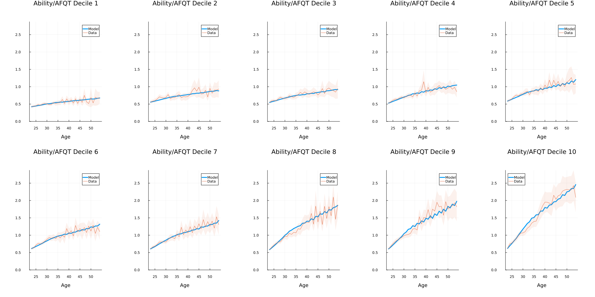
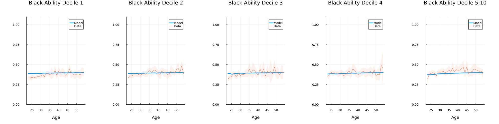
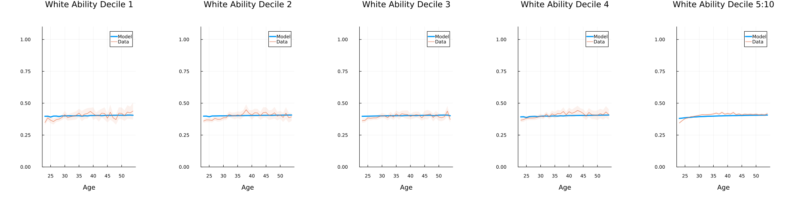
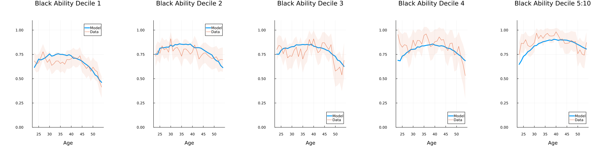
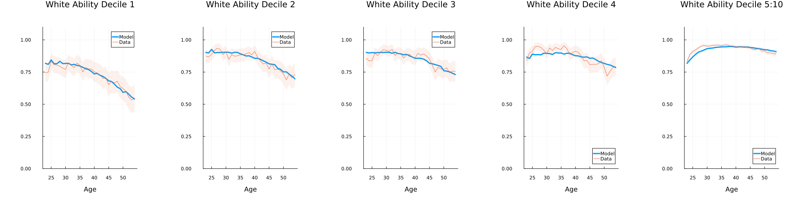
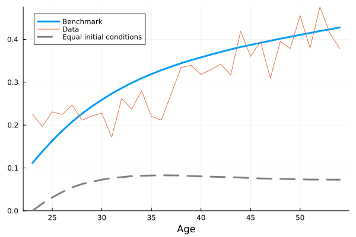
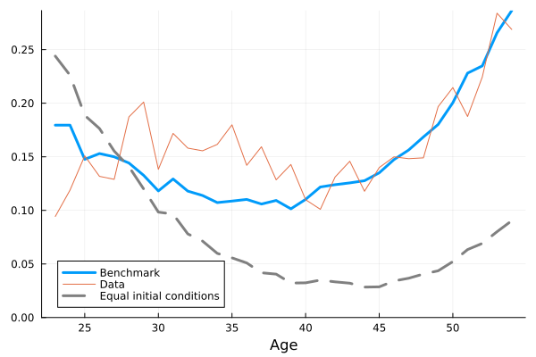

# RauhValladaresEsteban2023.jl
[This package](https://github.com/drarnau/RauhValladaresEsteban2023) solves the on-the-job human capital accumulation model with heterogeneity in the initial human capital endowment and the lifelong ability to accumulate human capital, and endogenous labor supply at the extensive and intensive margins in [_On the Black-White Gaps in Labor Supply and Earnings over the Lifecycle in the US_](https://arnau.eu/RaceGap.pdf) by [Christopher Rauh](https://sites.google.com/site/econrauh/) and [Arnau Valladares-Esteban](https://arnau.eu/).

## Documentation

## `produce_exhibits.jl`
Produces all the figures and tables displayed below and reported in the paper.

### Model simulated wages (using data labour supply) vs. data

### Model simulated hours vs. data

### Model simulated employment vs. data

### Model racial gaps over the life cycle vs. data
| Hourly Wage                   | Employment                        |
|:-----------------------------:|:---------------------------------:|
|   |   |

### [Counterfactual experiments](tables/counterfactuals.pdf)
<object data="tables/counterfactuals.pdf" type="application/pdf" width="100%">
    <embed src="tables/counterfactuals.pdf">
        
The PDF cannot be displayed in the GitHub README file. Please clik here to view it: <a href="tables/counterfactuals.pdf">View PDF</a>.

    </embed>
</object>
