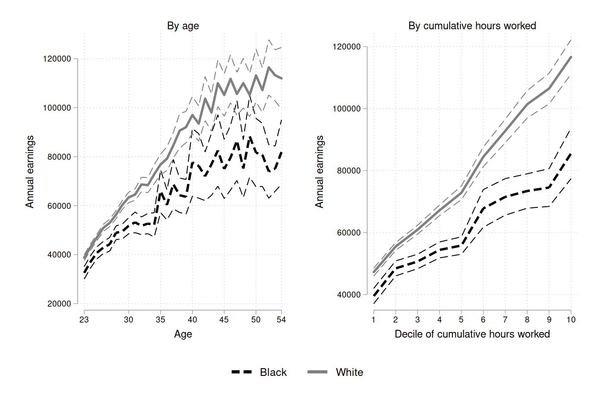

# RauhValladaresEsteban2023.jl
[This package](https://github.com/drarnau/RauhValladaresEsteban2023) provides all codes to replicate the main exhibits of [_On the Black-White Gaps in Labor Supply and Earnings over the Lifecycle in the US_](https://arnau.eu/RaceGap.pdf) by [Christopher Rauh](https://sites.google.com/site/econrauh/) and [Arnau Valladares-Esteban](https://arnau.eu/).

The user needs to download the raw data from the [National Longitudinal Survey of the Youth 1979](https://www.nlsinfo.org/content/cohorts/nlsy79) and store it in the folder `stata/` following the naming details in `stata/main.do`.

## `produce_exhibits.jl`
Produces all the figures and tables displayed below and reported in the paper.

## Model Documentation
 [![Docs][docs-img]][docs-url]

[docs-img]: https://img.shields.io/badge/docs-stable-blue.svg
[docs-url]: https://drarnau.github.io/RauhValladaresEsteban2023.jl/

#### Figure 1: Employment, hours worked, cumulative experience, and annual earnings over the lifecycle by Black and White men

#### Table 1: Test of parallelism in earnings experience profiles between Black and White men
See `stata/main.do`.

#### Figure 2: Mean annual earnings over the lifecycle for Black and White men that do not experience any non-employment spell

#### Figure 3: Distribution of AFQT deciles by race

#### Figure 4: Hourly earnings conditional on working by race for AFQT deciles over the lifecycle

#### [Table 2: Regressing hourly earnings conditional on working on race and cumulative labor market experience for AFQT deciles 1-5](tables/hearnings_1.pdf)
<object data="tables/hearnings_1.pdf" type="application/pdf" width="100%">
    <embed src="tables/hearnings_1.pdf">
        
The PDF cannot be displayed in the GitHub README file. Please click here to view it: <a href="tables/hearnings_1.pdf">View PDF</a>.

    </embed>
</object>

#### Figure 5: Employment rates over the lifecycle by race and AFQT deciles

#### Figure 6: Mean hourly wages over the lifecycle conditional on working by AFQT/ability decile (data vs. model)

### Figure 7: Hours worked over the lifecycle conditional on employment for AFQT/ability groupings by race (data vs. model)

#### Figure 8: Employment rates over the lifecycle by AFQT/ability decile (data vs. model)

#### [Table 5: How racial gaps respond to assigning characteristics of White men to Black men](tables/counterfactuals.pdf)
<object data="tables/counterfactuals.pdf" type="application/pdf" width="100%">
    <embed src="tables/counterfactuals.pdf">
        
The PDF cannot be displayed in the GitHub README file. Please click here to view it: <a href="tables/counterfactuals.pdf">View PDF</a>.

    </embed>
</object>

#### Figure 9: Racial gaps over the lifecycle in the data: benchmark and counterfactual of equal initial conditions
| Hourly Wage                   | Employment                        |
|:-----------------------------:|:---------------------------------:|
|   |   |

#### Figure B.1: Annual (left) and hourly (right) log labor income over the lifecycle

#### [Table B.1: Regressing hourly earnings conditional on working on race and cumulative labor market experience by AFQT deciles](tables/hearnings_2.pdf)
<object data="tables/hearnings_2.pdf" type="application/pdf" width="100%">
    <embed src="tables/hearnings_2.pdf">
        
The PDF cannot be displayed in the GitHub README file. Please click here to view it: <a href="tables/hearnings_2.pdf">View PDF</a>.

    </embed>
</object>

#### Figure B.2: Hours worked conditional on working by race for AFQT deciles over the lifecycle

#### Figure B.3: Mean annual earnings over the lifecycle conditional on working for Black and White men that experience no non-employment spells, by education groups

#### Figure B.4: Mean annual earnings by cumulative hours worked conditional on working for Black and White men that experience no non-employment spells, by education groups

#### Figure B.5: AFQT score distributions by race and education (absolute)

#### Figure B.6: AFQT score distributions by race and education (relative)

#### Figure B.7: Hourly wages conditional on working for AFQT score groupings by race over the lifecycle for men without non-employment spells

#### Figure B.8: Mean individual fixed effect (left) and experience effect (right) for hourly wage by race and AFQT decile

#### Figure B.9: Distribution of individual fixed effects (left) and experience effects (right) for hourly wage by race and AFQT decile

#### Figure B.10: Mean hourly wages at age 23

#### Figure B.11: Mean hourly wages at age 23 for Blacks and Whites

#### Figure B.12: Yearly earnings for AFQT/ability groupings by race over the lifecycle (data vs. model

#### Figure B.13: Employment rates for AFQT/ability deciles 5-10 by race over the lifecycle (data vs. model

#### Figure B.14: Hours worked conditional on working for AFQT/ability deciles 5-10 by race over the lifecycle (data vs. model)

